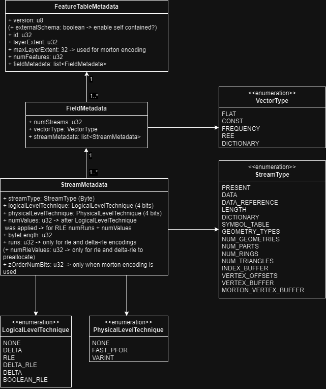
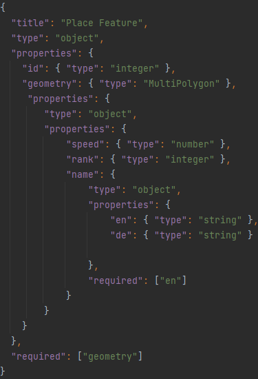
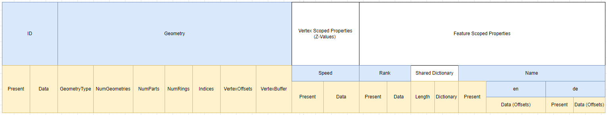
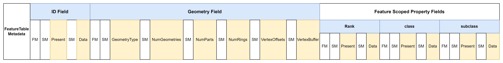

# MapLibre Tile (MLT) Specification

The MLT format is mainly inspired by the [Mapbox Vector Tile (MVT)](https://github.com/mapbox/vector-tile-spec) specification, but has been redesigned from the ground 
to primarily improve on the following topics:
- **Improved compression ratio**: based on a column oriented layout with (custom) lightweight encodings
- **Better decoding performance**: fast lightweight encodings which can be used in combination with SIMD/vectorization instructions
- **Support for linear referencing and m-values**: to efficiently support the upcoming next generation source formats such as Overture Maps (GeoParquet)
- **Support for a more complex type system**: Including nested properties, lists and maps
- **Support for 3D coordinates**
- **Improved processing performance**: Based on an in-memory format that can be processed efficiently on the CPU and GPU and loaded directly 
  into GPU buffers partially (like polygons in WebGL) or completely (in case of WebGPU compute shader usage) without additional processing

In order to combine a good compression ratio with fast decoding and processing, the MLT format is split into an in-memory and a storage format.
The storage format is used for the cost-efficient storage and low latency transfer of the vector data over the network.
The in-memory format is inspired by the in-memory analytics formats such as Apache Arrow as well as the 3D graphics format  [glTF](https://github.com/KhronosGroup/glTF/blob/main/specification/2.0/README.md)
and tailored for the map visualization use case to be efficient processed and rendered at runtime.    
One main design goal of the MLT spec is the fast transcoding of the storage into the in-memory format.

## 1. Storage Format

### 1.1 Basics
MLT divides a geographic region into tiles. 
A tile is basically a collection of ``FeatureTable`` which contains the actual thematic grouped vector data. 
A FeatureTable groups a collection of ``Feature`` with a similar semantic and structure and is the equivalent to a ``Layer`` in the MVT spec.
The features of a FeatureTable share a common set of attribute (property) columns and mostly a common geometry type 
(but not restricted to one common geometry type). 
In practise the visual appearance of the vector data on the map can be defined by assigning a corresponding style to a FeatureTable.
For example by using the [Mapbox Style Specification](https://docs.mapbox.com/style-spec/guides/) in combination with MapLibre Tiles, 
layers with a visual representation of the vector data contained in the FeatureTables can be defined.
As common in mapping, a feature is modeled by an optional id column, a mandatory geometry column and optional property columns. 
The geometry model is based on the Simple Feature Access Model (SFA) of the OGC without the support for GeometryCollection.  
The geometries of a FeatureTable are not restricted to one geometry type, but this is recommended for reasons of efficiency.
As in MVT, the coordinates of the geometries are encoded as vector tile grid (integer) coordinates.

> **_Note:_** Column and Field are used interchangeably in this document.

### 1.2 File Layout

A FeatureTable in the MLT specification is based on a tabular column oriented layout.
It uses different lightweight compression schemes for efficient encoding the values of the columns.
A FeatureTable consists of a optional `id` column, a mandatory `geometry` column and optional `property` columns.
Because there is no file header, ``FeatureTables`` can be concatenated on the fly.
   
A logical column is separated into physical streams inspired by the ORC file format.
For example a nullable string property column can have a `present stream`, which indicates the presence of a value, 
a ``length`` stream, which describes the number of characters of every string, and a ``data stream``, with the actual 
UTF-8 encoded string values. Technically, a stream is a known-length sequence of values (continuous chunk of memory) 
all having the same type, with some additional metadata like the size of the stream and the used encoding.

#### 1.2.1 Metadata

##### Tileset Metadata

The metadata per tileset are stored in a separate Protocol Buffers file.  
In the tileset metadata file, informations of the full tileset as well as the name and structure of the FeatureTables are defined.  
The tileset metadata file is the equivalent to the TileJSON spec, which is commonly used in combination with MVT.  
By defining the information once per tileset, the definition of redundant (shared) metadata per tile will be avoided,
which can take some relevant space of the overall size on small tiles.  
The tileset metadata scheme can be found [here](schema/maplibre_tile_metadata.proto)

> **_Open Question:_** Should there be also the option  for self-contained tiles, so that the metadata can als be embedded into the tiles
> like MVT, which can be consumed also without TileJSON?

##### Tile Metadata

In addition to the metadata that applies to the entire tileset, 
every tile contains three additional types of sections with information about it's structure.    
- **FeatureTableMetadata**: contains information about the FeatureTable, such as the ID to connect to the tileset metadata and the number of features. 
  Every FeatureTable is preceded by a ``FeatureTableMetadata`` section.  
- **FieldMetadata**: contains information about the number of streams the field is divided and the vector type for efficient decoding into the
  in-memory format. Every Field (column) section is preceded by a ``FieldMetadata`` section.  
- **StreamMetdata**: contains information about the Stream such as the used encoding schemes
  and the number of values. Every Stream section is preceded by a ``StreamMetadata`` section.       

Since for every Field a FieldMetadata section has to be present, even for Fields which are not included in one
specific tile, no id for the identification is needed.    
The abstinence for an entire field in a tile can be identified by a zero value for the number of streams.    
All integers in the metadata are Varint encoded if u32 is used or bit packed in case
of a u8 data type.     

#### 1.2.2 Type system

MapLibre Tiles has support for the following data types for the columns of a FeatureTable including nested types like `Struct`:

| DataType                      | Description                                                                                            | Streams               |
|-------------------------------|--------------------------------------------------------------------------------------------------------|-----------------------|
| Boolean                       |                                                                                                        | Present, Data         |
| Int32, UInt32, UInt64,  Int64 | separation between signed and unsigned types for more efficient encoding. Little Endian byte ordering. | Present, Data         |
| Float, Double                 | 32- and 64- bit floating point numbers encoded according to the IEEE 754 spec.                         | Present, Data         |
| String                        | UTF-8 encoded string.                                                                                  | Present, Length, Data |
| Geometry                      | Interleaved x and y coordinate encoding of Int32 values.                                               | see ...               |
| GeometryZ                     | Interleaved x, y and z coordinate encoding of Int32 values.                                            | see ...               | 
| Binary                        | Stream of bytes.                                                                                       | Present, Length, Data |        |
| Struct                        | Structured data type.                                                                                  | see ...               |
| List                          | Collection of values.                                                                                  | see ...               |
| Map                           | Collection of key-value paris                                                                          | see ...               |
| RangeSet                      | Special data structure for a efficient representation of linear referencing.                           | see ...               |
| Timestamp                     | TBD                                                                                                    | Present, Data         |
| Date                          | TBD                                                                                                    | Present, Data          |

Primitive data types like boolean, float or integer have fixed size and therefore are only stored in a data stream
in addition to the optional present stream. Variable sized data types like String, Binary or List hava an additional
length stream which specifies the size of each element.

##### Nested Fields Encoding

For nested properties such as structs and lists a [present/length](https://arxiv.org/pdf/2304.05028.pdf)  pair encoding 
is selected over the widely used Dremel encoding,
since it is simpler to implement and faster to decode into the in-memory format.
Every nullable field, defined in the tileset metadata, has an additional ``present`` stream.
Every field that is a collection type, such as a list, has an additional ``length`` stream that specifies the length of the field.
Like in ORC, the nested fields are flattened based on a pre-order traversal.
In addition, nested fields can be used a shared dictionary encoding, to share a common dictionary between the fields.
This can be applied for example on localized values of the name:* columns of an OSM dataset that can be identical across fields.
If a shared dictionary encoding is used for nested fields, all fields that use the shared dictionary 
must be grouped one behind the other in the file and prefixed with the dictionary.

##### RangeSets

RangeSets are an efficient way to encode linear referencing information, as used for example in [Overture Maps](https://docs.overturemaps.org/overview/feature-model/scoping-rules#geometric-scoping-linear-referencing).
RangesSets store the range values and data values in two separate streams.  
The min and max values for the ranges are stored as interleaved double values in a separate range stream.

#### 1.2.3 Encoding Schemes
MLT uses different lightweight compression schemes, for the space efficient storage and fast decoding of the data types.
To further reduce the size of a column the encodings can be recursively cascadinated (hybrid encodings)  up to a certain level.
For example the resulting integer columns of a dictionary encoding can be further compressed based on one of the Integer encoding schemes.
The following encoding pool for specific data types was selected based on the analytics on the efficiency
in terms of the compression ratio and decoding speed on test datasets such s the OpenMapTiles schema and Bing Maps based tilesets.

| DataType | Logical  Level Technique                                                               | Physical Level Technique                                         | Description |
|----------|----------------------------------------------------------------------------------------|------------------------------------------------------------------|-------------|
| Boolean  | [Boolean RLE](https://orc.apache.org/specification/ORCv1/#boolean-run-length-encoding) |                                                                  |             | 
| Integer  | Plain, RLE, Delta, Delta-RLE                                                           | [SIMD-FastPFOR](https://arxiv.org/pdf/1209.2137.pdf), [Varint](https://protobuf.dev/programming-guides/encoding/#varints) |             |
| Float    | Plain, TBD (RLE, Dictionary, ...)                                                      |                                                                  |             | 
| String   | Plain, Dictionary, [FSST](https://www.vldb.org/pvldb/vol13/p2649-boncz.pdf) Dictionary |                                                                  |             | 
| Geometry | Plain, Dictionary, Morton-Dictionary                                                   |                                                                  |             | 

Since SIMD-FastPFOR generally produces smaller data streams and is faster to decode, it should be preferred over Varint encoding.
Varint encoding is mainly added tpo the pool for compatibilities reasons and it's simpler implementation compared to SIMD-FastPFOR. 
Varint encoding also can be more efficient when used in combination with heavyweight compression schemes like GZip.

To find the best coding schemes for a specific data type from the coding pool, using a brute force approach by testing all available schemes 
with respect to the resulting column size would be too costly. The recommended approach improves the selection time by using
the selection strategy described in the [BTRBlocks](https://www.cs.cit.tum.de/fileadmin/w00cfj/dis/papers/btrblocks.pdf) paper:
- First, calculation of data metrics to early exclude encodings. For example if the average run length is less than 2, 
  RLE encoding is not a candidate for the encodings pool
- Second, use a sampling-based algorithm for choosing the best compression scheme out of the pool by taking randomly parts
  of the data with a total size of 1% of the full data and apply the encoding schemes selected in step 1. Apply the encoding scheme
  on the data which produces the smallest output

#### 1.2.4 FeatureTable Layout
##### ID Column

The id column is modeled separately from the properties for better compatibility with
MVT and to narrow to the int datatype for size reasons.  
By narrowing down to Uint32 FastPfor128 can be used.

| Datatype       |           Encodings            |      
|----------------|:------------------------------:|          
| Uint32, Uint64 | see availabe integer encodings |

> **_Open Question:_** Should the ID column really separately for better compatibility with
> MVt and to narrow it down to int for size reasons or give no special meaning to it and 
> let the user add them to the properties 
> -> only add recommendation for int
> -> Overture also has 128 bit ids

##### Geometry Column

The main idea is to use a Structure of arrays (data-oriented design) layout for the geometries.
The x,y and the optional z coordinates are stored interleaved in a ``VertexBuffer`` so that they can be efficiently processed
on the CPU or even directly copied to GPU buffers. If the z coordinate is not relevant for rendering, it can be stored separate as
an m-coordinate (see vertex-scoped properties).

The information about the geometry of the features is separated in different streams and is partly inspired
by the [geoarrow](https://github.com/geoarrow/geoarrow) specification.   
Using separate streams for describing the geometry of a feature enables a better optimization of the compression 
and faster processing. In addition, pre-tessellated meshes of polygons
can be stored directly in the file to avoid the time-consuming triangulation step.  
A geometry column can consist of the following streams:

| Stream name   |     Data type     |                encoding                |  mandatory  |     
|---------------|:-----------------:|:--------------------------------------:|:-----------:|      
| GeometryType  |       Byte        |     see availabe integer encodings     |  &#10003;   |
| NumGeometries |      UInt32       |     see availabe integer encodings     |  &#10007;   |  
| NumParts      |      UInt32       |     see availabe integer encodings     |  &#10007;   |
| NumRings      |      UInt32       |     see availabe integer encodings     |  &#10007;   |
| NumTriangles  |      UInt32       |     see availabe integer encodings     |  &#10007;   |
| IndexBuffer   |      UInt32       |     see availabe integer encodings     |  &#10007;   |
| VertexOffsets |      UInt32       |     see availabe integer encodings     |  &#10007;   |
| VertexBuffer  | Int32 or Vertex[] | Plain, Dictionary or Morton Dictionary |  &#10003;   |

Depending on the type of the geometry, the geometry column can have the following streams in addition to the ``GeometryType`` stream:
- Point: VertexBuffer
- LineString: NumParts, VertexBuffer
- Polygon: NumParts (Polygon), NumRings (LinearRing), VertexBuffer
- MultiPoint: NumGeometries, VertexBuffer
- MultiLineString: NumGeometries, NumParts (LineString), VertexBuffer
- MultiPolygon: NumGeometries, NumParts (Polygon), NumRings (LinearRing), VertexBuffer

In addition, the geometry column can consist of an additional ``VertexOffsets`` stream when a Dictionary or Morton-Dictionary 
encoding is applied. If the geometries (mainly polygons) are stored in a tessellated/triangulated form for direct copying to a GPU Buffer, 
an additional ``NumTriangles`` and ``IndexBuffer`` has to be provided.

##### Property Columns

The properties of a feature are divided into ``feature-scoped`` and ``vertex-scoped`` properties.   
The values of feature-scoped properties are related to a specific Feature, which means there is one value in
a property column per feature. 
The values of a vertex-scoped properties are related to each vertex, which means there is one value in a property column
per vertex in the VertexBuffer. This allows to model what is known as M-coordinates in GIS applications.
Vertex-scoped properties have to be grouped together and are placed before the feature-scoped properties in the FeatureTable.
A property column can have on of the above listed [data types](#1.2.2 Type system).

### 1.3 Example Layouts

In the following, examples for the layout of a FeatureTable in storage are illustrated.
The following colors are used to highlight different kind of data:
- blue boxes: fields whith only logical character and are not persisted.
  Based on the TileSet metadata the fields can be reconstructed from the streams.
- white boxes: metadata which are describing the structure of the data. The metadata are divided into 
  FeatureTable, Stream (SM) and Feature (FM) metadata
- yellow boxes: streams which contains the actual data

#### 1.3.1 Place layer
Given a place layer with the following structure modeled as Json schema:  

For the given schema the place layer can have the following layout in a MLT tile
when a dictionary for the `geometry` and `name` column is used.

#### 1.3.2 LineString geometry with flat properties
Encoding of a FeatureTable with a id field, a LineString geometry field and the flat feature scoped properties class and subclass:

#### 1.3.3 MultiPolygon with flat properties
Encoding of a FeatureTable with a id field, MultiPolygon geometry field and flat feature scoped property fields. 
  Because vertex dictionary encoding is used a ``VertexOffsets`` stream is present:
  

#### 1.3.4 Vertex-scoped and feature-scoped properties
Example layout for encoding of vertex scoped and feature scoped properties.
All vertex scoped properties have to be grouped together and placed before the feature scoped properties
in the file. Since the id colum in this example is not ``nullable`` the present stream
can be omitted.

### Sorting

Choosing the right column for sorting the features can have significant impact on the size
of the FeatureTable. To take full advantage of the columnar layout sorting is crucial.
To test every layer for every possible sorting order of every column
is too costly. In the following a simple ruleset is illustrated which proved to produce good
results in the tests.

**TBD**

## 2. In-Memory Format
> **_Notes:_** The in-memory format is explained in more detail; the following is only a rough overview
>

The record-oriented in-memory model (array of structures approach) used by the libraries that process 
the Mapbox Vector Tiles leads to a considerable overhead, such as the creation of a large number of small objects,
that place an additional load on the garbage collector in the browser. 
By using a columnar memory layout (data-oriented design), for the MLT in-memory format, we can overcome this issues and 
additionally take advantage of an improved cache utilization for subsequent access and fast SIMD instructions for the processing of the data.    
The MLT in-memory format incorporates and extends the ideas from the analytical in-memory formats Apache Arrow, Velox 
and the DuckDB execution format and is tailored for the visualization use case. To be future proven it is important that the file can be in parallel processed on the GPU for the 
usage within a GPU compute shader.
The main design goals of the MLT in-memory format are:
- Enable advanced CPU throughput by optimizing the memory layout for cache locality and SIMD instructions
- Allow random (mainly constant time) access to all data, so it also can be parallel processed on the GPU (WebGPU compute shader)
- Provide compressed data structure which can be directly processed without decoding
- Parts of the geometries of a tile should be already in a renderable form and can be therefore directly loaded into GPU buffers with no additional processing

The data are stored in continuous memory buffers, referred to as vectors, with additional metadata and an optional nullability bitmap 
for representing null values. The storage format contains a ``VectorType`` field in the metadata that tells the decoder 
which vector type to use for a specific filed. In order to enable random access to variable-sized data types such as strings or lists, 
an auxiliary buffer containing offset values will be utilized.

The MLT in-memory format supports the following vectors:
- [Flat Vectors](https://duckdb.org/internals/vector.html#flat-vectors)
- [Dictionary Vectors](https://duckdb.org/internals/vector.html#dictionary-vectors)
- [Constant Vectors](https://duckdb.org/internals/vector.html#constant-vectors)
- [Sequence vectors](https://duckdb.org/internals/vector.html#sequence-vectors)
- [Run-End Encoded (REE) Vectors](https://arrow.apache.org/docs/format/Columnar.html#run-end-encoded-layout)

> **_Note:_** Further evaluation is needed to determine if the [latest research findings](https://arxiv.org/pdf/2306.15374.pdf) 
> can be used to enable random access on delta encoded values as well

In case a compressed vector can be used, this has the additional advantage that the conversion from the storage 
into in-memory format is basically a zero-copy operation.

> **_Open Question:_** Use a constant and sequence vector in addition to the REE vector?

### Technical Terminology

in the following a small glossary to help disambiguate
- **Column or Field**:
- **Stream**:
- **Feature**:
- **FeatureTable**:

